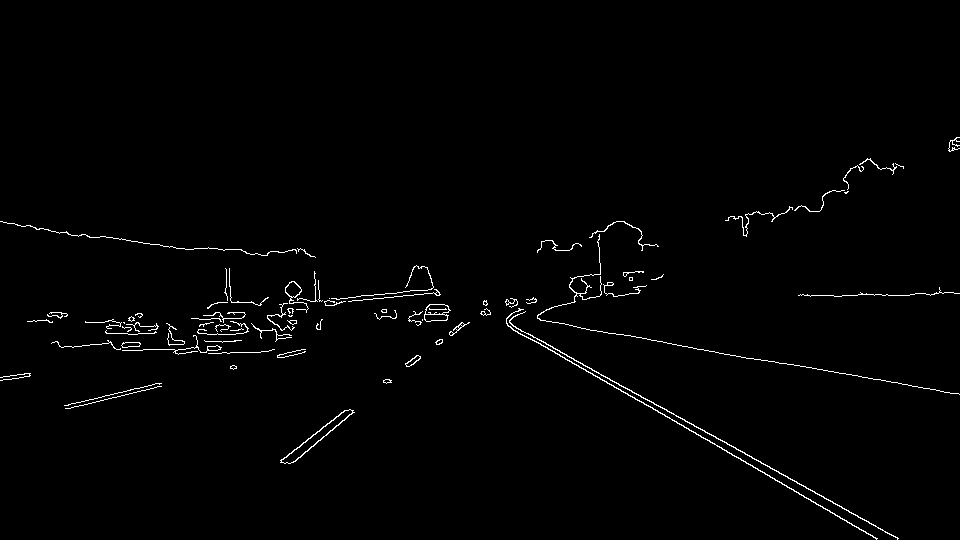
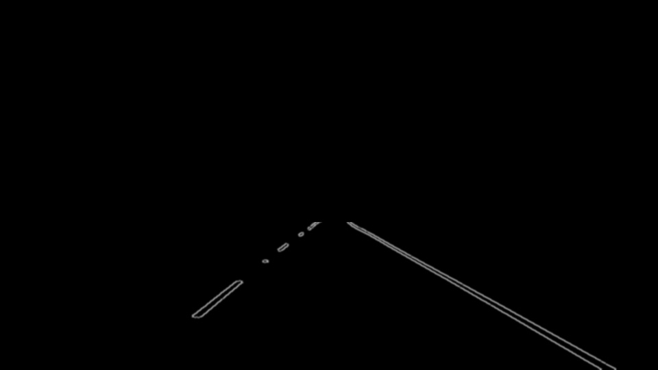
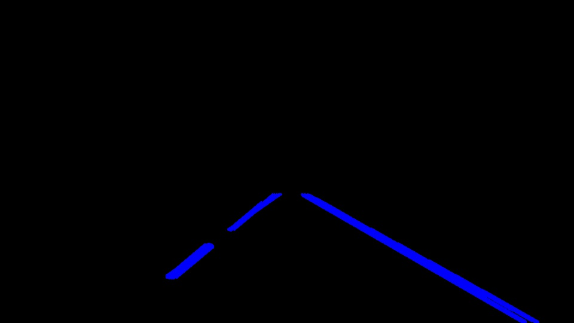
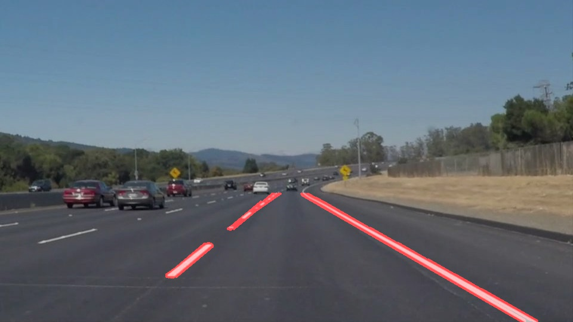
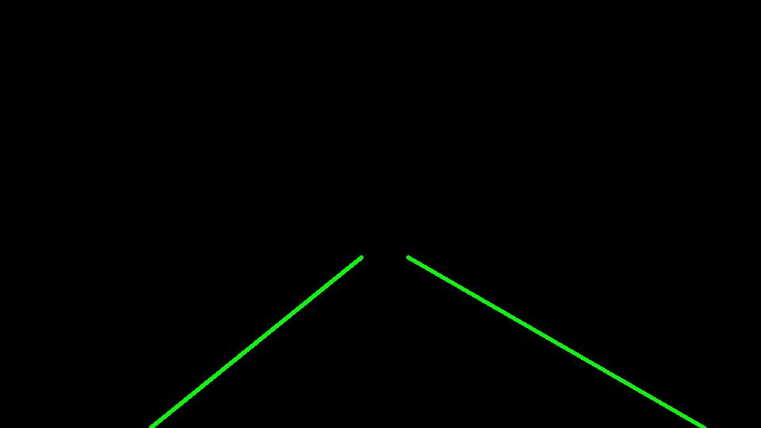
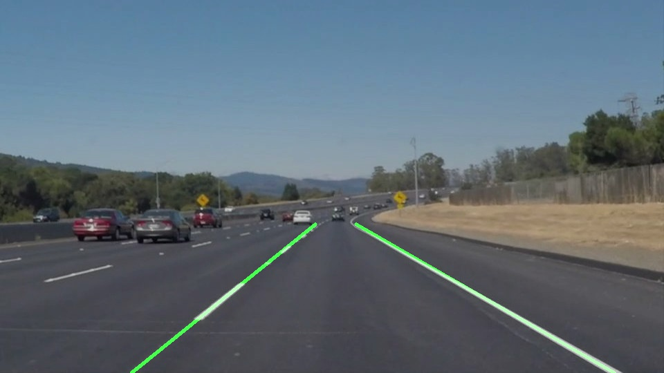

# **Finding Lane Lines on the Road** 

## Writeup

---

**Finding Lane Lines on the Road**

The goals / steps of this project are the following:
* Make a pipeline that finds lane lines on the road
* Reflect on your work in a written report


---

### Reflection

### 1. Description of the pipeline

My pipeline consisted of 6 steps:

1. First, I converted the images to grayscale this reduces the amount of processing.


2. Then I applied a gaussian blur on the image with kernel size 5. This ensured that the edges were smooth and much of the random noise pixels be removed.

3. Third I applied Canny edge detection on the blurred image to detect all the edges. I followed the recommended 1:3 ratio for canny and used 66 for the low threshold and 200 for the high threshold. This gave me a good set of edge pixels to work with. I added an additional gaussian blur to further cut down on noise.




4. Next I immediately applied a Region of Interest mask on the image (A trapezoid shape to get a proper slice of the correct section of the road). I observed that nearly all of the test image data had camera mounted at the centre of the car and the car was centred on the lane. Thus I could cut out nearly 10% of the width of the image from either side at the bottom leaving with just the lane lines and the road. Similarly the road was visible clearly upto 60% of the height from the top above which the roads were unclear or horizon started. hence the top portion was clipped at 60% of height of the image, and across the width about 80pixels.
By applying the ROI immediately I could cut down on the amout of points on which the lines needed to be detected.



5. In the next step I applied Probabilistic Hough lines function to detect lines from the region masked image. I was able increase perfomrance by cutting down on the angular resoulution. I used rho =1, theta = pi/180 * 5. I made sure that I would only detect valid line segments by setting a higher threshold of 50. and made sure that collections of smaller points do not form a line by increasing the minimum line length(20) and maximum line gap(20). This gave me lines only on the correct lane line edges.



6. In the last step I super imposed the detected lane lines on top of the original image and wrote it to the test_images_output folder/file_name.jpg




In order to draw a single line on the left and right lanes, I modified the `draw_lines()` function as follows:
* I added an additional keyword parameter to both `hough_lines()` function and `draw_lines()` function to take a `boolean` for extrapolation. When set to true I modify the draw_lines function to calculate single line for each of left and right lane. For this I used the following algorithm:
   For each line detected calculate the gradient(m) and y intercept(b) (exclude lines with infinite gradient)
   if gradient < 0 add it to the right lane else add it to the left lane.
   calculate the average of both m and b for each lane
   for both left and right line use the calculated m and b values to find (x,y) coordinates from 60% of height of image to 100% of height of image
   draw these lines.

   


* Finally I super imposed the extrapolated lane lines on top of the original image and wrote it to the test_images_output folder/extrapolated_file_name.jpg

Besides these changes, I have also made additional changes to how the image is loaded. These are as follows:
* The list of files and base folder name are maintained in variables
```python
folder = "test_images/"
files = ['file_name_1.jpg','file_name_2.jpg',...]
```
* Image is changed by updating the array index of `curr_file` variable:
```python
curr_file = files[0]
image = mpimg.imread(folder+curr_file)
```
* The following code is used to show the extrapolated and non extrapolated images on jupiter notebook side by side:
```python
h, w, _ = image.shape
out_img = np.zeros((h, w*2, 3),image.dtype)
out_img[:,:w] = wgt_img
out_img[:,w:] = wgt_img_extrapolated
plt.imshow(out_img)
```


### 2. Potential shortcomings with the current pipeline


* One potential shortcoming would be what would happen when the roads are constantly changing from shadows to bright lights. As seen in the challenge video, I am unable to detect the edges on yellow lane marking when in brightly lit areas.

* Another shortcoming is appearance of potholes etc or other vehicles entering the lane on the road itself where the region is not masked can cause extrapolated lines to behave wildly.

* There can be issues with winding roads where it is no longer possible to accurately draw a straight line at all.


### 3. Some Suggestions to possibly improve the  pipeline

* A possible improvement would be to use Sobel x to prononuce vertical edges even on brightly lit areas. I tried this approach and gave slight improvements on the challenge video, however this also gave erreneous lines due to dirt or potholes on the road in the test images thus deteriorating the earlier result. Hence I have disabled the use of sobelx. 

* Another potential improvement could be to split the ROI into to seperate regions left and right and process them seperately so that lines that criss cross across the road are not detected.

* Some kind of adaptive thresholding could also be used to improve detection of edges while moving across different lighting conditions.

* Finally It is also possible that we can detect curves instead of lines to improve the detection of winding roads.

